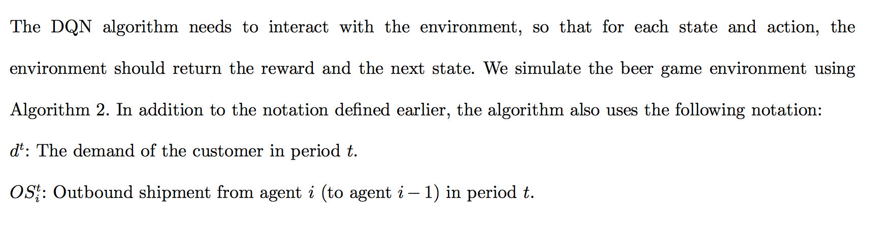
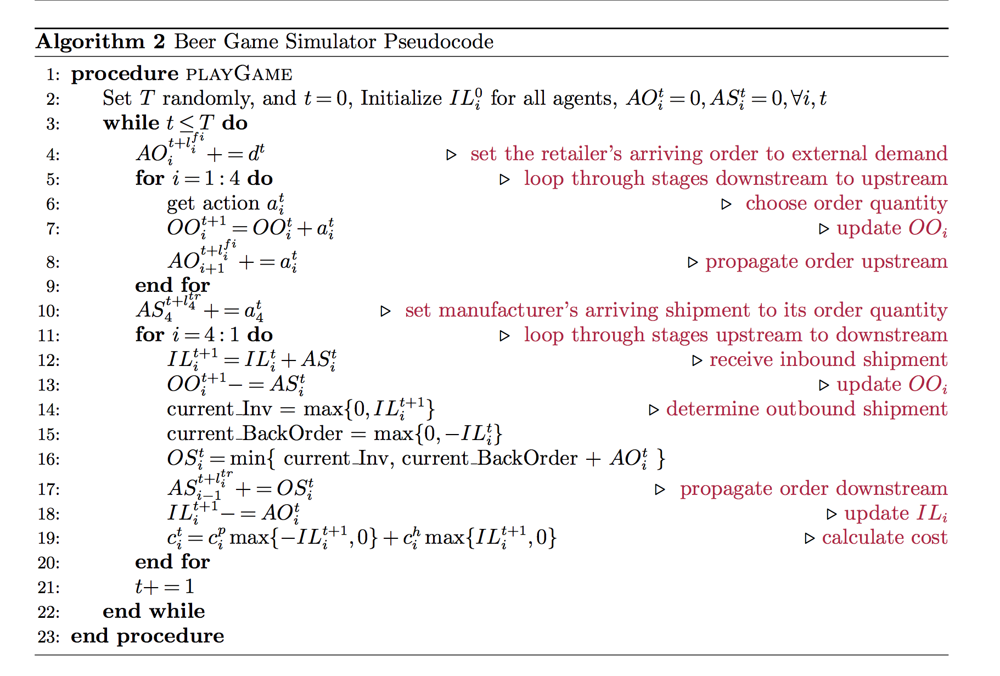

# beergame
复现beergame

## 项目结构

- Beer_game :啤酒游戏环境

  - [readme](./Beer_game/README.md)
  - [environment](./Beer_game/beer_game_env.py)
  - [测试](./Beer_game/test_env.py)

- DQN

  - [dqn model](./dqn/deepqn.py)

## todo

- [x] 弄清楚beergame的原理

- [x] 弄清楚state的定义

- [x] dqn bug修改

- [x] 四人游戏需要封装env和agents成一个play的类.

## Q&A

- [x] 大家有什么问题可以写在这里

## References

- [1] [A Deep Q-Network for the Beer Game: Reinforcement Learning for Inventory Optimization](https://arxiv.org/pdf/1708.05924.pdf)

- [2] pesudocode from [1]

